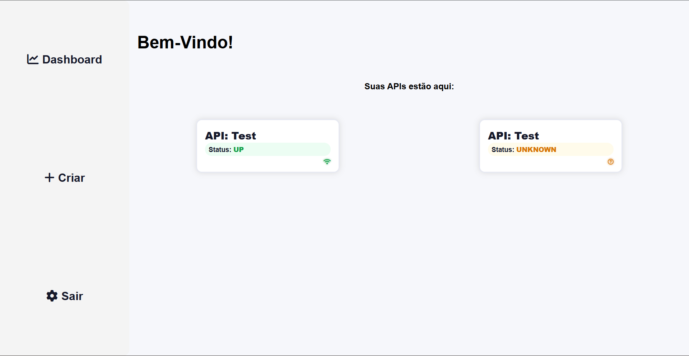
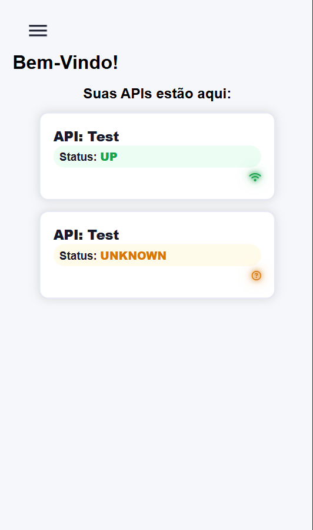
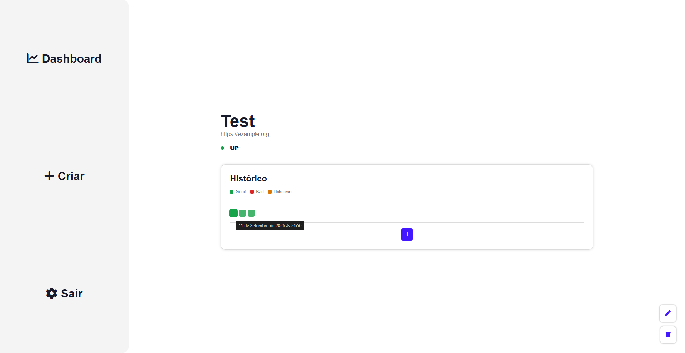
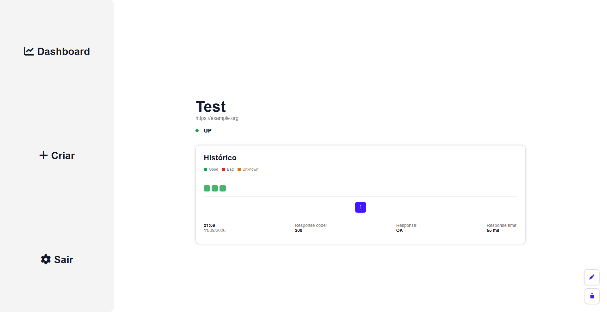
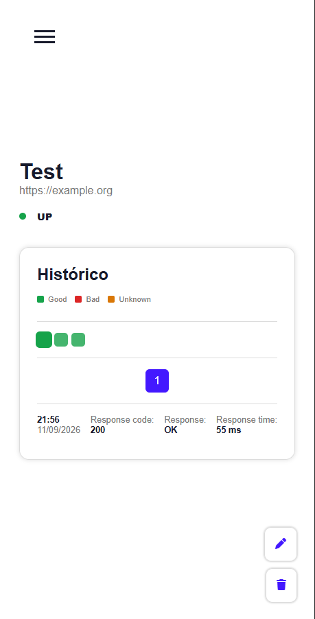
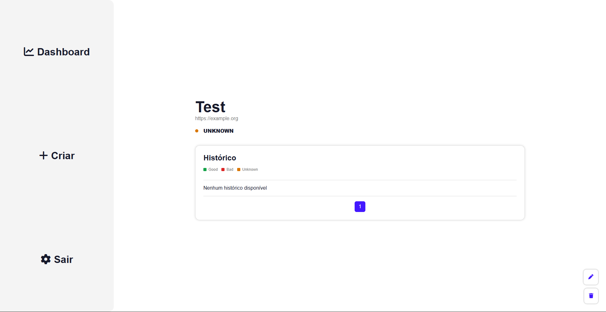
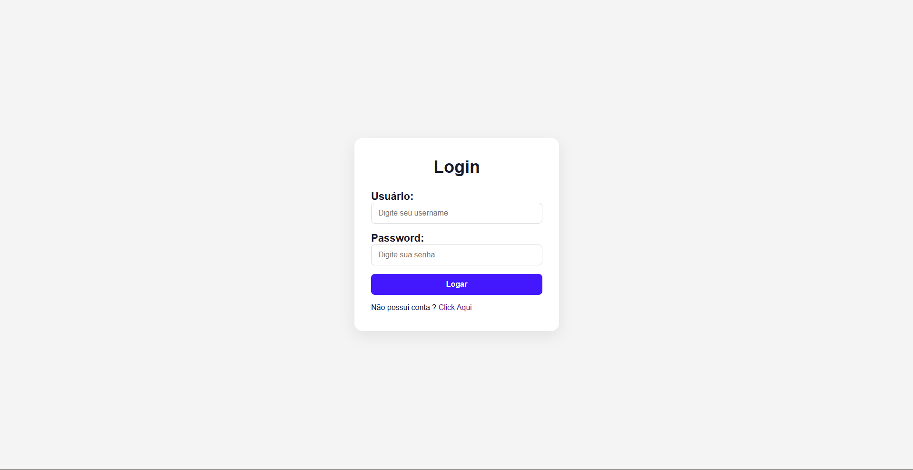
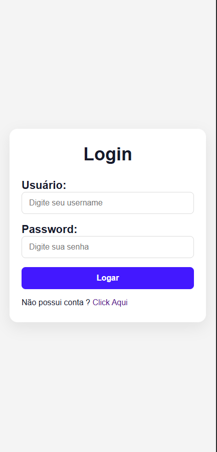
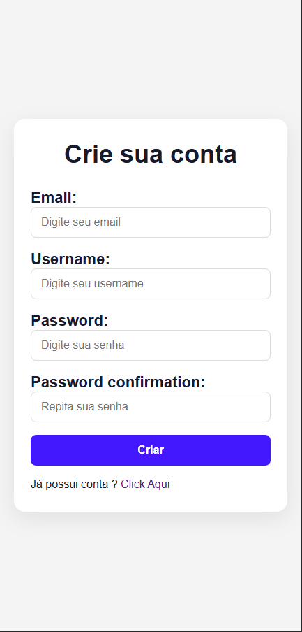
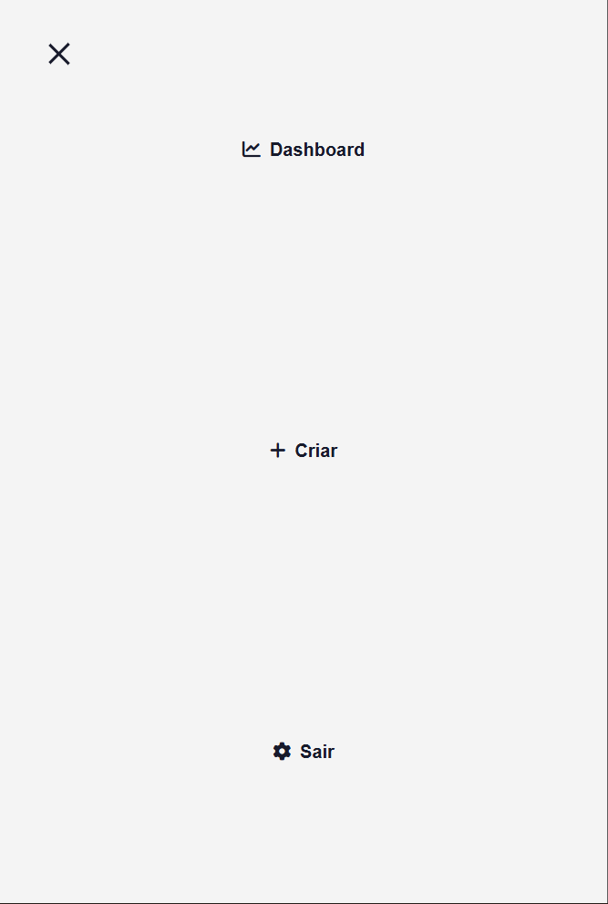

<h1 align="center">     🛡️ APIGuard </h1> 
     Plataforma de monitoramento de APIs e serviços desenvolvida com Django. 
 
                                         

---

<h2 id="sobre-o-projeto">📖 Sobre o Projeto</h2>

O <strong>APIGuard</strong> é uma aplicação web desenvolvida para monitorar a disponibilidade e o desempenho de APIs e serviços.

A aplicação permite que usuários cadastrem APIs que desejam monitorar e acompanhem o estado atual de cada serviço, incluindo sua disponibilidade, código HTTP, tempo de resposta e histórico das verificações realizadas.

O monitoramento é realizado automaticamente em segundo plano utilizando <strong>Celery</strong> e <strong>Redis</strong>, permitindo que as verificações sejam executadas de forma independente das requisições realizadas pelo usuário na aplicação web.

Cada verificação realizada gera um registro no histórico da API, permitindo acompanhar o comportamento do serviço ao longo do tempo e identificar situações como indisponibilidade, timeout e erros de conexão.

Durante o desenvolvimento, trabalhei com autenticação de usuários, regras de negócio, controle de acesso aos dados, separação de responsabilidades utilizando Services, processamento assíncrono com Celery, utilização do Redis como broker e cache, testes automatizados e integração contínua utilizando GitHub Actions.

<h2 id="sumario">📑 Sumário</h2>
<ul>
    <li><a href="#sobre-o-projeto">📖 Sobre o Projeto</a></li>
    <li><a href="#funcionalidades">✨ Funcionalidades</a></li>
    <li><a href="#tecnologias-utilizadas">🚀 Tecnologias Utilizadas</a></li>
    <li>
        <a href="#regras-de-negocio">📋 Regras de Negócio</a>
        <ul>
            <li><a href="#usuarios">👤 Usuários</a></li>
            <li><a href="#limite-de-apis">🔢 Limite de APIs</a></li>
            <li><a href="#status-da-api">📊 Status da API</a></li>
            <li><a href="#respostas-http">🌐 Respostas HTTP</a></li>
            <li><a href="#timeout">⏱️ Timeout</a></li>
            <li><a href="#erro-de-conexao">🔌 Erro de Conexão</a></li>
            <li><a href="#historico">📜 Histórico</a></li>
        </ul>
    </li>
    <li><a href="#arquitetura">🏗️ Arquitetura</a></li>
    <li><a href="#estrutura-do-projeto">📁 Estrutura do Projeto</a></li>
    <li>
        <a href="#estrutura-do-banco">🗄️ Estrutura do Banco</a>
        <ul>
            <li><a href="#api">📡 API</a></li>
            <li><a href="#history">📜 History</a></li>
            <li><a href="#relacionamentos">🔗 Relacionamentos</a></li>
        </ul>
    </li>
    <li><a href="#monitoramento">📡 Monitoramento</a></li>
    <li><a href="#redis">🔴 Redis</a></li>
    <li><a href="#autenticacao">🔐 Autenticação</a></li>
    <li><a href="#testes">🧪 Testes</a></li>
    <li><a href="#integracao-continua">⚙️ Integração Contínua</a></li>
    <li>
    <a href="#executando-o-projeto">🚀 Executando o Projeto</a>
        <ul>
            <li><a href="#deploy">☁️ Deploy</a></li>
            <li><a href="#variaveis-de-ambiente">🔐 Variáveis de Ambiente</a></li>
        </ul>
    </li>
    <li>
        <a href="#identidade-visual">🪪 Identidade visual</a>
        <ul>
            <li><a href="#escolha-das-core">🎨 Escolha das Cores</a></li>
            <li><a href="#mobile-first">📱 Mobile First</a></li>
        </ul>
    </li>
</ul>

---

<h2 id="funcionalidades">✨ Funcionalidades</h2>
<ul>
    <li>Cadastro de usuários</li>
    <li>Login e autenticação</li>
    <li>Cadastro de APIs para monitoramento</li>
    <li>Edição das APIs cadastradas</li>
    <li>Exclusão das APIs cadastradas</li>
    <li>Visualização individual de cada API</li>
    <li>Monitoramento automático das APIs cadastradas</li>
    <li>Visualização do status atual de cada API</li>
    <li>Identificação de APIs disponíveis</li>
    <li>Identificação de APIs indisponíveis</li>
    <li>Identificação de APIs que ainda não foram verificadas</li>
    <li>Identificação e controle de timeouts consecutivos</li>
    <li>Identificação de erros de conexão</li>
    <li>Registro do código HTTP retornado pela API</li>
    <li>Registro do tempo de resposta das requisições</li>
    <li>Registro do histórico de verificações</li>
    <li>Paginação do histórico de verificações</li>
    <li>Cache das APIs exibidas no dashboard</li>
    <li>Execução das verificações através de tarefas assíncronas</li>
    <li>Execução automática das verificações utilizando Celery Beat</li>
    <li>Isolamento das APIs de acordo com o usuário proprietário</li>
    <li>Limite de 5 APIs cadastradas por usuário</li>
</ul>

---

<h2 id="tecnologias-utilizadas">🚀 Tecnologias Utilizadas</h2>
<table>
    <thead>
        <tr>
            <th>Tecnologia</th>
            <th>Utilização</th>
        </tr>
    </thead>
    <tbody>
        <tr>
            <td><strong>Python 3.14</strong></td>
            <td>Linguagem principal utilizada no desenvolvimento da aplicação.</td>
        </tr>
        <tr>
            <td><strong>Django 6.1</strong></td>
            <td>Framework responsável pela estrutura da aplicação web, autenticação, Models, Forms, Views e gerenciamento das requisições.</td>
        </tr>
        <tr>
            <td><strong>Celery 5.6</strong></td>
            <td>Responsável pela execução das verificações das APIs em tarefas assíncronas e pelo processamento automático em segundo plano.</td>
        </tr>
        <tr>
            <td><strong>Redis</strong></td>
            <td>Utilizado como broker para o Celery e como sistema de cache da aplicação.</td>
        </tr>
        <tr>
            <td><strong>django-redis</strong></td>
            <td>Integração do Redis com o sistema de cache do Django.</td>
        </tr>
        <tr>
            <td><strong>Requests</strong></td>
            <td>Biblioteca utilizada para realizar as requisições HTTP durante as verificações das APIs.</td>
        </tr>
        <tr>
            <td><strong>SQLite</strong></td>
            <td>Banco de dados utilizado durante o desenvolvimento e nos tests</td>
        </tr>
        <tr>
            <td><strong>PostgreSQL</strong></td>
            <td>Banco de dados utilizado no ambiente de produção/docker.</td>
        </tr>
        <tr>
            <td><strong>Poetry</strong></td>
            <td>Gerenciamento das dependências e do ambiente do projeto.</td>
        </tr>
        <tr>
            <td><strong>Docker</strong></td>
            <td>Utilizado para containerizar a aplicação e executar o Django, PostgreSQL, Redis, Celery Worker e Celery Beat.</td>
        </tr>
        <tr>
            <td><strong>HTML</strong></td>
            <td>Estruturação das páginas e componentes da interface.</td>
        </tr>
        <tr>
            <td><strong>CSS</strong></td>
            <td>Estilização e responsividade da interface da aplicação.</td>
        </tr>
        <tr>
            <td><strong>JavaScript</strong></td>
            <td>Utilizado para comportamentos e interações no lado do cliente.</td>
        </tr>
        <tr>
            <td><strong>GitHub Actions</strong></td>
            <td>Automação da integração contínua e execução dos testes do projeto.</td>
        </tr>
    </tbody>
</table>

---

<h2 id="regras-de-negocio">📋 Regras de Negócio</h2>

O APIGuard possui regras responsáveis por controlar o comportamento das APIs monitoradas, garantir o isolamento dos dados entre usuários e definir como cada verificação deve ser registrada no sistema.

<h3 id="usuarios">👤 Usuários</h3>
<ul>
    <li>Cada usuário possui suas próprias APIs cadastradas.</li>
    <li>O acesso às funcionalidades de monitoramento exige autenticação.</li>
    <li>Um usuário só pode visualizar, editar e excluir APIs pertencentes à sua própria conta.</li>
    <li>APIs pertencentes a outros usuários não podem ser acessadas através das URLs da aplicação.</li>
</ul>
<h3 id="limite-de-apis">🔢 Limite de APIs</h3>
<ul>
    <li>Cada usuário pode cadastrar no máximo <strong>5 APIs</strong>.</li>
    <li>Ao atingir o limite, o usuário não pode cadastrar novas APIs até que uma das APIs existentes seja removida.</li>
    <li>O limite é aplicado individualmente para cada usuário.</li>
</ul>
<h3 id="status-da-api">📊 Status da API</h3>

Cada API possui um status geral que representa sua situação atual no sistema.

<ul>
    <li>🟢 <strong>UP</strong> — a API está disponível e respondeu corretamente à verificação.</li>
    <li>🔴 <strong>DOWN</strong> — a API foi considerada indisponível.</li>
    <li>⚪ <strong>UNKNOWN</strong> — a API ainda não possui uma verificação registrada que permita determinar seu estado.</li>
</ul>
<h3 id="respostas-http">🌐 Respostas HTTP</h3>

O código HTTP retornado pela API é utilizado para determinar o resultado de cada verificação.

<ul>
    <li>🟢 Códigos <strong>2xx</strong> indicam uma resposta bem-sucedida e resultam em status <strong>UP</strong>.</li>
    <li>🟢 Códigos <strong>3xx</strong> são considerados respostas válidas e resultam em status <strong>UP</strong>.</li>
    <li>🔴 Códigos <strong>4xx</strong> indicam uma resposta de erro e resultam em status <strong>DOWN</strong>.</li>
    <li>🔴 Códigos <strong>5xx</strong> indicam um erro no servidor e resultam em status <strong>DOWN</strong>.</li>
    <li>📜 O código HTTP retornado é armazenado no histórico da verificação.</li>
</ul>
<h3 id="timeout">⏱️ Timeout</h3>

Quando uma API não responde dentro do tempo limite definido para a requisição, a verificação é considerada um timeout.

<ul>
    <li>⏱️ Cada timeout consecutivo incrementa o contador de timeouts da API.</li>
    <li>🔢 Após <strong>3 timeouts consecutivos</strong>, a API é considerada <strong>DOWN</strong>.</li>
    <li>🔄 Quando uma verificação retorna uma resposta válida, o contador de timeouts consecutivos é reiniciado.</li>
    <li>📜 Cada timeout também gera um registro no histórico da API.</li>
</ul>
<h3 id="erro-de-conexao">🔌 Erro de Conexão</h3>

Quando não é possível estabelecer uma conexão com a API monitorada, a verificação é tratada como um erro de conexão.

<ul>
    <li>🔌 O status da API é definido como <strong>DOWN</strong>.</li>
    <li>🔄 O contador de timeouts consecutivos é reiniciado.</li>
    <li>📜 O resultado da tentativa é registrado no histórico.</li>
</ul>
<h3 id="historico">📜 Histórico</h3>

Cada tentativa de verificação gera um registro no histórico da API, permitindo acompanhar o comportamento do serviço ao longo do tempo.

<ul>
    <li>📡 Cada verificação gera um novo registro.</li>
    <li>🌐 O código HTTP retornado é armazenado quando disponível.</li>
    <li>⚡ O tempo de resposta da requisição é armazenado quando disponível.</li>
    <li>📜 O resultado da resposta é registrado no histórico.</li>
    <li>📅 A data e hora da verificação são armazenadas automaticamente.</li>
    <li>📄 O histórico é apresentado de forma paginada na página de detalhes da API.</li>
</ul>

---

<h2 id="arquitetura">🏗️ Arquitetura</h2>

O APIGuard utiliza uma arquitetura baseada no padrão do <strong>Django</strong>, organizando a aplicação em diferentes responsabilidades para manter o código mais simples de entender e facilitar sua manutenção.

A aplicação é dividida principalmente entre o módulo de <strong>autenticação: accounts</strong>, responsável pelo gerenciamento dos usuários, o módulo de <strong>monitoramento: monitoring</strong>, responsável pelas APIs e suas verificações, e o módulo <strong>config</strong>, responsável pelas configurações gerais do projeto e pela integração com o Celery.

<h3>🔄 Fluxo do Monitoramento</h3>

As verificações das APIs são executadas de forma assíncrona utilizando <strong>Celery</strong>. O <strong>Redis</strong> atua como broker responsável por intermediar as tarefas entre a aplicação e os workers do Celery.

    <strong>Django → Celery Beat → Redis → Celery Worker → Verificação da API → Banco de Dados</strong>

<ul>
    <li>O Django gerencia a aplicação web e as solicitações realizadas pelos usuários.</li>
    <li>O Celery Beat agenda automaticamente as verificações periódicas.</li>
    <li>O Redis funciona como broker para as tarefas do Celery.</li>
    <li>O Celery Worker executa as tarefas de monitoramento em segundo plano.</li>
    <li>A API cadastrada é consultada através de uma requisição HTTP.</li>
    <li>O resultado da verificação determina o novo status da API.</li>
    <li>Cada tentativa gera um registro no histórico.</li>
    <li>As informações são persistidas no banco de dados.</li>
</ul>
<h3>🧩 Separação de Responsabilidades</h3>
<ul>
    <li><strong>Views</strong> — responsáveis pelo fluxo das requisições HTTP e interação com as páginas da aplicação.</li>
    <li><strong>Forms</strong> — responsáveis pela validação e processamento dos dados enviados pelos usuários.</li>
    <li><strong>Models</strong> — responsáveis pela representação dos dados e relacionamento com o banco de dados.</li>
    <li><strong>Services</strong> — concentram regras e operações específicas, como verificação das APIs, processamento das respostas e gerenciamento do cache.</li>
    <li><strong>Tasks</strong> — responsáveis por executar as verificações através do Celery.</li>
    <li><strong>Choices</strong> — responsáveis pela definição dos estados possíveis das APIs.</li>
</ul>
<h3>💾 Cache</h3>

O <strong>Redis</strong> também é utilizado como sistema de cache através do <strong>django-redis</strong>. As informações das APIs exibidas no dashboard são armazenadas temporariamente para reduzir consultas desnecessárias ao banco de dados.

O cache é invalidado quando uma API é criada, editada ou excluída, garantindo que as informações apresentadas ao usuário permaneçam atualizadas.

---

<h2 id="estrutura-do-projeto">📁 Estrutura do Projeto</h2>

O projeto é organizado em aplicações e módulos de acordo com suas responsabilidades.

<pre>
APIGuard/
├── .github/
│   └── workflows/
│       └── pipeline.yaml
├── .vscode/
│   └── settings.json
├── accounts/
│   ├── forms/
│   │   └── auth_form.py
│   ├── migrations/
│   ├── services/
│   │   └── user_services.py
│   ├── templates/
│   │   └── accounts/
│   │       ├── login.html
│   │       └── register.html
│   ├── tests/
│   │   ├── test_forms.py
│   │   └── test_views.py
│   ├── admin.py
│   ├── apps.py
│   ├── models.py
│   ├── urls.py
│   └── views.py
├── config/
│   ├── asgi.py
│   ├── celery.py
│   ├── settings.py
│   ├── urls.py
│   └── wsgi.py
├── monitoring/
│   ├── choices/
│   │   └── api_status.py
│   ├── forms/
│   │   └── api_form.py
│   ├── migrations/
│   ├── services/
│   │   ├── api_cache_services.py
│   │   ├── api_response_services.py
│   │   └── api_verification_class_services.py
│   ├── static/
│   │   └── monitoring/
│   │       ├── javascript/
│   │       │   ├── app.js
│   │       │   └── data-history.js
│   │       └── styles/
│   │           ├── buttons.css
│   │           ├── dashboard.css
│   │           ├── detail_api.css
│   │           └── menu.css
│   ├── templates/
│   │   └── monitoring/
│   │       ├── components/
│   │       │   ├── delete_link.html
│   │       │   ├── edit_link.html
│   │       │   └── menu.html
│   │       ├── create_api.html
│   │       ├── dashboard.html
│   │       ├── detail_api.html
│   │       └── edit_api.html
│   ├── tests/
│   │   ├── test_forms.py
│   │   ├── test_models.py
│   │   ├── test_services.py
│   │   └── test_views.py
│   ├── admin.py
│   ├── apps.py
│   ├── models.py
│   ├── tasks.py
│   ├── urls.py
│   └── views.py
├── static/
│   └── styles/
│       ├── form.css
│       └── root.css
├── templates/
│   └── base.html
├── .dockerignore
├── .env
├── .gitattributes
├── .gitignore
├── .python-version
├── build.sh
├── docker-compose.yml
├── Dockerfile
├── LICENSE
├── manage.py
├── poetry.lock
└── pyproject.toml
</pre>
<h3>📂 Principais Diretórios</h3>
<ul>
    <li><strong>accounts/</strong> — aplicação responsável pelo cadastro, login, autenticação e gerenciamento relacionado aos usuários.</li>
    <li><strong>config/</strong> — configurações principais do Django e integração com o Celery.</li>
    <li><strong>monitoring/</strong> — núcleo da aplicação, contendo Models, Views, Forms, Services, Tasks, Templates e testes relacionados ao monitoramento.</li>
    <li><strong>static/</strong> — arquivos estáticos compartilhados pela aplicação.</li>
    <li><strong>templates/</strong> — templates globais utilizados pela aplicação, incluindo o <strong>base.html</strong>.</li>
    <li><strong>.github/workflows/</strong> — configuração da integração contínua através do GitHub Actions.</li>
</ul>
<h3>⚙️ Arquivos de Configuração</h3>
<ul>
    <li><strong>manage.py</strong> — ponto de entrada para os comandos administrativos do Django.</li>
    <li><strong>pyproject.toml</strong> — configuração do projeto e gerenciamento das dependências através do Poetry.</li>
    <li><strong>poetry.lock</strong> — registra as versões exatas das dependências instaladas.</li>
    <li><strong>Dockerfile</strong> — define a imagem utilizada para executar a aplicação em container.</li>
    <li><strong>docker-compose.yml</strong> — configuração dos serviços utilizados durante a execução com Docker.</li>
    <li><strong>build.sh</strong> — script utilizado durante o processo de build da aplicação.</li>
    <li><strong>.env</strong> — arquivo destinado às variáveis de ambiente utilizadas pela aplicação.</li>
    <li><strong>pipeline.yaml</strong> — define o pipeline de integração contínua executado pelo GitHub Actions.</li>
</ul>

---

<h2 id="estrutura-do-banco">🗄️ Estrutura do Banco</h2>

O APIGuard utiliza um banco de dados relacional para armazenar os usuários, as APIs cadastradas e o histórico das verificações realizadas. A estrutura foi organizada para manter uma relação clara entre o proprietário da API, o serviço monitorado e os resultados de cada verificação.

<h3 id="api">📡 API</h3>

O modelo <code>API</code> representa cada serviço cadastrado para monitoramento. Cada API pertence a um usuário e armazena seu estado atual, além da quantidade de timeouts consecutivos registrados.

<table>
<tr>
<th>Campo</th>
<th>Descrição</th>
</tr>
<tr>
<td><code>id</code></td>
<td>Identificador único da API, gerado automaticamente pelo Django.</td>
</tr>
<tr>
<td><code>nickname</code></td>
<td>Nome utilizado pelo usuário para identificar a API.</td>
</tr>
<tr>
<td><code>url</code></td>
<td>Endereço do serviço que será monitorado.</td>
</tr>
<tr>
<td><code>api_status</code></td>
<td>Status atual da API: <code>UP</code>, <code>DOWN</code> ou <code>UNKNOWN</code>.</td>
</tr>
<tr>
<td><code>timeout_count</code></td>
<td>Quantidade de timeouts consecutivos registrados para a API.</td>
</tr>
<tr>
<td><code>owner</code></td>
<td>Usuário proprietário da API. Utiliza uma relação <code>ForeignKey</code> com o modelo <code>User</code>.</td>
</tr>
</table>
<h3 id="history">📜 History</h3>

O modelo <code>History</code> registra cada tentativa de verificação realizada pelo APIGuard. Dessa forma, além do estado atual da API, é possível consultar o histórico de respostas e acompanhar seu comportamento ao longo do tempo.

<table>
<tr>
<th>Campo</th>
<th>Descrição</th>
</tr>
<tr>
<td><code>id</code></td>
<td>Identificador único do registro, gerado automaticamente pelo Django.</td>
</tr>
<tr>
<td><code>api_response</code></td>
<td>Resultado obtido durante a verificação da API.</td>
</tr>
<tr>
<td><code>status_code</code></td>
<td>Código HTTP retornado pela API, quando disponível.</td>
</tr>
<tr>
<td><code>response_time</code></td>
<td>Tempo de resposta da API, quando disponível.</td>
</tr>
<tr>
<td><code>date</code></td>
<td>Data e horário em que a verificação foi registrada, preenchidos automaticamente pelo Django.</td>
</tr>
<tr>
<td><code>api</code></td>
<td>API relacionada ao registro de histórico. Utiliza uma relação <code>ForeignKey</code> com o modelo <code>API</code>.</td>
</tr>
</table>
<h3 id="relacionamentos">🔗 Relacionamentos</h3>

Os relacionamentos do banco seguem uma estrutura de um-para-muitos. Um usuário pode possuir várias APIs, enquanto cada API pertence a apenas um usuário. Da mesma forma, uma API pode possuir vários registros de histórico, enquanto cada registro de histórico pertence a apenas uma API.

<pre>
┌──────────────────────┐
│         User         │
│──────────────────────│
│ id                   │
│ username             │
│ ...                  │
└──────────┬───────────┘
           │
           │ 1 : N
           │
           ▼
┌──────────────────────┐
│         API          │
│──────────────────────│
│ id                   │
│ nickname             │
│ url                  │
│ api_status           │
│ timeout_count        │
│ owner                │
└──────────┬───────────┘
           │
           │ 1 : N
           │
           ▼
┌──────────────────────┐
│       History        │
│──────────────────────│
│ id                   │
│ api_response         │
│ status_code          │
│ response_time        │
│ date                 │
│ api                  │
└──────────────────────┘
</pre>

<strong>Relacionamentos principais:</strong>

<ul>
    <li><strong>User → API:</strong> um usuário pode possuir várias APIs, mas cada API possui apenas um proprietário através do campo <code>owner</code>.</li>
    <li><strong>API → History:</strong> uma API pode possuir vários registros de histórico através do campo <code>api</code>, sendo criado um novo registro a cada verificação.</li>
</ul>

As duas relações utilizam <code>on_delete=models.CASCADE</code>. Dessa forma, quando um usuário é removido, suas APIs também são removidas e, consequentemente, os registros de histórico associados a essas APIs também são excluídos.

O relacionamento reverso também é definido pelos atributos <code>apis</code> e <code>histories</code>, permitindo acessar as APIs de um usuário através de <code>user.apis</code> e os históricos de uma API através de <code>api.histories</code>.

<h2 id="monitoramento">📡 Monitoramento</h2>

O APIGuard realiza verificações automáticas para acompanhar a disponibilidade e o tempo de resposta das APIs cadastradas. O processo é executado em segundo plano, permitindo que o usuário continue utilizando a aplicação normalmente enquanto as verificações são realizadas.

A cada verificação, o sistema realiza uma requisição HTTP para a URL cadastrada e analisa o resultado obtido. A partir dessa resposta, o status atual da API é atualizado e um novo registro é criado no histórico.

<h3>🔄 Fluxo de Verificação</h3>
<pre>
┌───────────────────┐
│   Celery Beat     │
│ Agenda a tarefa   │
└─────────┬─────────┘
          │
          ▼
┌───────────────────┐
│  Redis (Broker)   │
│  Envia a tarefa   │
└─────────┬─────────┘
          │
          ▼
┌───────────────────┐
│  Celery Worker    │
│ Executa a tarefa  │
└─────────┬─────────┘
          │
          ▼
┌───────────────────┐
│ Verificação HTTP  │
│  da API cadastrada│
└─────────┬─────────┘
          │
          ▼
┌───────────────────┐
│ Processamento do  │
│ resultado da API  │
└─────────┬─────────┘
          │
          ├──────────────► Atualiza API
          │
          └──────────────► Cria History
</pre>
<h3>📊 Classificação das Respostas</h3>

O status da API é determinado de acordo com o resultado da verificação. Respostas HTTP de sucesso ou redirecionamento, correspondentes às faixas <code>2xx</code> e <code>3xx</code>, são consideradas disponíveis. Respostas nas faixas <code>4xx</code> e <code>5xx</code> são consideradas indisponíveis.

<table>
<tr>
<th>Resultado</th>
<th>Status</th>
<th>Comportamento</th>
</tr>
<tr>
<td><code>2xx</code></td>
<td><code>UP</code></td>
<td>API considerada disponível.</td>
</tr>
<tr>
<td><code>3xx</code></td>
<td><code>UP</code></td>
<td>API considerada disponível.</td>
</tr>
<tr>
<td><code>4xx</code></td>
<td><code>DOWN</code></td>
<td>API considerada indisponível.</td>
</tr>
<tr>
<td><code>5xx</code></td>
<td><code>DOWN</code></td>
<td>API considerada indisponível.</td>
</tr>
<tr>
<td>Timeout</td>
<td>Depende da sequência</td>
<td>Incrementa o contador de timeouts consecutivos.</td>
</tr>
<tr>
<td>Erro de conexão</td>
<td><code>DOWN</code></td>
<td>API considerada indisponível e contador de timeout reiniciado.</td>
</tr>
</table>
<h3>⏱️ Controle de Timeout</h3>

O APIGuard possui um controle de timeouts consecutivos através do campo <code>timeout_count</code>. Cada timeout incrementa esse contador. Ao atingir três timeouts consecutivos, a API passa para o estado <code>DOWN</code>.

Quando uma resposta válida é recebida, o contador de timeouts é reiniciado. Um erro de conexão também coloca a API como <code>DOWN</code> e reinicia o contador.

<h3>📜 Registro do Histórico</h3>

Cada verificação realizada gera um registro no modelo <code>History</code>. Quando disponíveis, são armazenados o código HTTP e o tempo de resposta. Isso permite acompanhar não apenas a disponibilidade atual da API, mas também seu comportamento ao longo do tempo.

 
<h2 id="redis">🔴 Redis</h2>

O <strong>Redis</strong> possui duas responsabilidades diferentes no APIGuard: atuar como <strong>broker do Celery</strong> e como <strong>cache da aplicação Django</strong>. Para manter essas responsabilidades separadas, são utilizadas bases lógicas diferentes dentro do Redis.

<table>
<tr>
<th>Uso</th>
<th>Banco Redis</th>
<th>Finalidade</th>
</tr>
<tr>
<td>Celery Broker</td>
<td><code>DB 0</code></td>
<td>Armazena e transporta as mensagens das tarefas do Celery.</td>
</tr>
<tr>
<td>Django Cache</td>
<td><code>DB 1</code></td>
<td>Armazena temporariamente dados utilizados com frequência pela aplicação.</td>
</tr>
</table>
<h3>⚡ Cache</h3>

O cache é utilizado principalmente para reduzir consultas desnecessárias ao banco de dados no carregamento do dashboard. As informações das APIs exibidas no dashboard podem ser reutilizadas enquanto estiverem disponíveis no cache.

Quando uma API é criada, editada ou removida, o cache relacionado é invalidado para evitar que informações antigas continuem sendo exibidas.

<h2 id="autenticacao">🔐 Autenticação</h2>

O APIGuard utiliza o sistema de autenticação integrado do Django para gerenciar usuários, sessões e controle de acesso. A aplicação possui páginas próprias para cadastro e login, enquanto o gerenciamento das credenciais permanece sob responsabilidade dos recursos nativos do framework.

<h3>👤 Cadastro e Login</h3>

Usuários podem criar uma conta através da página de cadastro e posteriormente realizar o login para acessar as funcionalidades protegidas da aplicação.

As rotas relacionadas à autenticação ficam concentradas na aplicação <code>accounts</code>, mantendo essa responsabilidade separada da aplicação principal de monitoramento.

<h3>🛡️ Controle de Acesso</h3>

As funcionalidades de monitoramento exigem que o usuário esteja autenticado. As views protegidas utilizam os mecanismos de autenticação do Django, como <code>LoginRequiredMixin</code>.

<h3>🔒 Isolamento das APIs</h3>

Cada API possui um proprietário definido através do campo <code>owner</code>. As consultas e operações realizadas sobre as APIs consideram o usuário autenticado, garantindo que um usuário não consiga visualizar, editar ou excluir APIs pertencentes a outra conta.

Esse controle é aplicado diretamente nas consultas realizadas pela aplicação, mantendo o isolamento dos dados entre os usuários.

</writing>

<h2 id="testes">🧪 Testes</h2>

O APIGuard possui testes automatizados utilizando o sistema de testes integrado do Django. Os testes têm como objetivo validar tanto componentes individuais quanto o comportamento das principais funcionalidades da aplicação.

<h3>📋 Organização dos Testes</h3>

Os testes estão separados de acordo com a responsabilidade de cada componente, facilitando a manutenção e permitindo identificar com maior precisão a origem de possíveis falhas.

<table>
<tr>
<th>Arquivo</th>
<th>Responsabilidade</th>
</tr>
<tr>
<td><code>test_models.py</code></td>
<td>Testa o comportamento e as regras relacionadas aos modelos do banco de dados.</td>
</tr>
<tr>
<td><code>test_forms.py</code></td>
<td>Valida os formulários utilizados pela aplicação e suas regras de validação.</td>
</tr>
<tr>
<td><code>test_views.py</code></td>
<td>Testa o comportamento das views, autenticação, acesso às páginas e operações realizadas pelos usuários.</td>
</tr>
<tr>
<td><code>test_services.py</code></td>
<td>Valida a lógica de negócio responsável pelo processamento e verificação das APIs.</td>
</tr>
</table>
<h3>▶️ Executando os Testes</h3>

Os testes podem ser executada através do comando abaixo:

<pre>
poetry run python manage.py test
</pre>

A execução utiliza um banco de dados de testes separado, permitindo validar o comportamento da aplicação sem modificar os dados utilizados durante o desenvolvimento.

<h2 id="integracao-continua">⚙️ Integração Contínua</h2>

Configurei o <strong>GitHub Actions</strong> para automatizar a execução dos testes sempre que alterações são enviadas para o repositório. Dessa forma, o projeto possui uma verificação automática que ajuda a identificar problemas antes que novas alterações sejam integradas ao código principal.

<h3>🔄 Pipeline</h3>
<pre>
┌──────────────────────┐
│ Push / Pull Request  │
└──────────┬───────────┘
           │
           ▼
┌──────────────────────┐
│    GitHub Actions    │
│   Inicia o ambiente  │
└──────────┬───────────┘
           │
           ▼
┌──────────────────────┐
│ Instala dependências │
│      com Poetry      │
└──────────┬───────────┘
           │
           ▼
┌──────────────────────┐
│     Inicia Redis     │
│  Serviço necessário  │
└──────────┬───────────┘
           │
           ▼
┌──────────────────────┐
│ Executa os testes    │
│       Django         │
└──────────┬───────────┘
           │
      ┌────┴────┐
      │         │
      ▼         ▼
   Sucesso    Falha
      │         │
      ▼         ▼
  Pipeline    Pipeline
  aprovado    interrompido
</pre>

<h2 id="executando-o-projeto">🚀 Executando o Projeto</h2>

O APIGuard pode ser executado localmente utilizando Docker, que permite iniciar todo o ambiente necessário para a aplicação, incluindo PostgreSQL, Redis, Django, Celery Worker e Celery Beat.

<h3>🐳 Executando com Docker</h3>

O projeto possui um <code>Dockerfile</code> responsável por criar a imagem da aplicação e um <code>docker-compose.yml</code> responsável por orquestrar os serviços necessários.

A arquitetura local utiliza cinco serviços:

<table>
<tr>
<th>Serviço</th>
<th>Responsabilidade</th>
</tr>
<tr>
<td><code>postgres</code></td>
<td>Banco de dados PostgreSQL utilizado pela aplicação.</td>
</tr>
<tr>
<td><code>redis</code></td>
<td>Broker e cache utilizado pelo sistema.</td>
</tr>
<tr>
<td><code>web</code></td>
<td>Executa a aplicação Django e realiza as migrações antes de iniciar o servidor.</td>
</tr>
<tr>
<td><code>celery-worker</code></td>
<td>Executa as tarefas de monitoramento em segundo plano.</td>
</tr>
<tr>
<td><code>celery-beat</code></td>
<td>Agenda as tarefas periódicas de monitoramento.</td>
</tr>
</table>
<h3>⚙️ Configuração do Ambiente</h3>

Antes de iniciar os containers, é necessário configurar as variáveis de ambiente utilizadas pela aplicação através do arquivo <code>.env</code>.

As credenciais utilizadas pelo PostgreSQL no Docker Compose também são obtidas através das variáveis de ambiente, permitindo que o banco seja configurado sem deixar essas informações diretamente no arquivo de configuração.

<h3>▶️ Inicializando os Containers</h3>

Com o Docker Desktop em execução e o arquivo <code>.env</code> configurado, os serviços podem ser iniciados com:

<pre>
docker compose up --build
</pre>

O serviço <code>web</code> executa automaticamente as migrações do Django antes de iniciar o servidor de desenvolvimento dentro do container.

Após a inicialização, a aplicação estará disponível localmente em:

<pre>
http://localhost:8000
</pre>

Os dados do PostgreSQL são armazenados em um volume Docker chamado <code>postgres_data</code>, permitindo que os dados do banco sejam preservados quando os containers forem recriados.

<h3 id="deploy">☁️ Deploy</h3>

O APIGuard também possui uma versão publicada no Render:

<a href="https://apiguard.onrender.com/dashboard">https://apiguard.onrender.com/</a>

A aplicação web está disponível publicamente, porém o ambiente atual utiliza o plano gratuito do Render, que não disponibiliza um Background Worker para executar o Celery de forma contínua. Por esse motivo, a aplicação publicada possui funcionamento parcial: a interface web e as funcionalidades que não dependem da execução contínua do Celery permanecem disponíveis, enquanto o monitoramento automático em segundo plano não funciona em produção nesse ambiente.

Localmente, essa limitação não existe, pois o <code>docker-compose.yml</code> inicia separadamente o <code>celery-worker</code> e o <code>celery-beat</code>.

<h2 id="variaveis-de-ambiente">🔐 Variáveis de Ambiente</h2>

    O arquivo <code>.env</code> deve ser criado na raiz do projeto, no mesmo nível do arquivo <code>manage.py</code>. Por conter informações sensíveis, ele não deve ser versionado no repositório.

<h3>⚙️ Configuração do <code>.env</code></h3>

    Para executar o projeto utilizando o Docker Compose, configure as seguintes variáveis:

<h3>📝 Descrição das Variáveis</h3>

<table>
    <tr>
        <th>Variável</th>
        <th>Descrição</th>
    </tr>
    <tr>
        <td><code>SECRET_KEY</code></td>
        <td>Chave secreta utilizada pelo Django para recursos de segurança da aplicação.</td>
    </tr>
    <tr>
        <td><code>DEBUG</code></td>
        <td>Define se o modo de depuração do Django está ativado.</td>
    </tr>
    <tr>
        <td><code>ALLOWED_HOSTS</code></td>
        <td>Define os hosts permitidos pelo Django.</td>
    </tr>
    <tr>
        <td><code>CSRF_TRUSTED_ORIGINS</code></td>
        <td>Define as origens confiáveis para proteção CSRF.</td>
    </tr>
    <tr>
        <td><code>POSTGRES_DB</code></td>
        <td>Nome do banco de dados PostgreSQL criado pelo container.</td>
    </tr>
    <tr>
        <td><code>POSTGRES_USER</code></td>
        <td>Usuário utilizado para acessar o PostgreSQL.</td>
    </tr>
    <tr>
        <td><code>POSTGRES_PASSWORD</code></td>
        <td>Senha utilizada pelo usuário do PostgreSQL.</td>
    </tr>
    <tr>
        <td><code>POSTGRES_HOST</code></td>
        <td>Host utilizado pelo Django para acessar o PostgreSQL. No Docker Compose, corresponde ao nome do serviço <code>postgres</code>.</td>
    </tr>
    <tr>
        <td><code>POSTGRES_PORT</code></td>
        <td>Porta utilizada pelo PostgreSQL dentro da rede Docker.</td>
    </tr>
    <tr>
        <td><code>CELERY_BROKER_URL</code></td>
        <td>Endereço utilizado pelo Celery para se comunicar com o Redis como broker.</td>
    </tr>
    <tr>
        <td><code>REDIS_CACHE_URL</code></td>
        <td>Endereço utilizado pelo Django para armazenar o cache no Redis.</td>
    </tr>
</table>

<h3>🔴 Redis e Bancos Lógicos</h3>

    O Redis utilizado pelo Docker Compose é acessado através do nome do serviço <code>redis</code>. As duas funcionalidades utilizam bancos lógicos diferentes para manter suas responsabilidades separadas.

<pre>
redis://redis:6379/0  →  Celery Broker
redis://redis:6379/1  →  Django Cache
</pre>

    O <code>DB 0</code> é utilizado pelo Celery para transportar as tarefas entre o Beat e os Workers, enquanto o <code>DB 1</code> é utilizado pelo sistema de cache do Django.

<h3>🗄️ PostgreSQL no Docker</h3>

    O PostgreSQL também utiliza as variáveis do arquivo <code>.env</code>. O Docker Compose utiliza <code>POSTGRES_DB</code>, <code>POSTGRES_USER</code> e <code>POSTGRES_PASSWORD</code> para criar e configurar o banco de dados.

    Já o Django utiliza essas informações juntamente com <code>POSTGRES_HOST</code> e <code>POSTGRES_PORT</code> para estabelecer a conexão com o banco.

    Dentro da rede criada pelo Docker Compose, o host utilizado pelo Django não é <code>localhost</code>, mas sim <code>postgres</code>, que corresponde ao nome do serviço definido no <code>docker-compose.yml</code>.

<h2 id="identidade-visual">🪪 Identidade Visual</h2>

Durante o desenvolvimento do APIGuard, procurei criar uma interface simples e consistente, utilizando cores, espaçamentos e componentes reutilizáveis para manter o mesmo padrão visual nas diferentes páginas da aplicação.

<h3 id="escolha-das-core">🎨 Escolha das Cores</h3>

Defini uma cor primária em tons de azul e roxo para representar os principais elementos de interação da aplicação, como botões, links e elementos de navegação. A cor primária também possui uma variação mais escura para situações que exigem um segundo nível de destaque.

Além da cor primária, defini cores específicas para representar os estados das APIs. Dessa forma, o usuário consegue identificar visualmente a situação de um serviço sem depender apenas do texto apresentado na interface.

<ul>
    <li>🟣 <strong>Cor primária</strong> — utilizada nos principais elementos de interação da aplicação.</li>
    <li>🟢 <strong>Verde</strong> — representa APIs disponíveis.</li>
    <li>🔴 <strong>Vermelho</strong> — representa APIs indisponíveis.</li>
    <li>🟠 <strong>Laranja</strong> — representa APIs com estado desconhecido.</li>
    <li>⚪ <strong>Cores neutras</strong> — utilizadas em textos, bordas, fundos e elementos de suporte da interface.</li>
</ul>

As cores foram centralizadas em variáveis CSS dentro do arquivo <code>root.css</code>. Isso permite reutilizar os mesmos valores em diferentes partes da aplicação e facilita a manutenção da identidade visual.

<h3>📁 Organização dos Arquivos CSS</h3>

Separei os arquivos CSS de acordo com a responsabilidade de cada conjunto de estilos. A ideia foi evitar um único arquivo contendo todas as regras da aplicação e, ao mesmo tempo, evitar a duplicação de estilos que podem ser utilizados em diferentes páginas.

<ul>
    <li><strong>root.css</strong> — contém variáveis e configurações globais utilizadas por diferentes páginas.</li>
    <li><strong>form.css</strong> — contém estilos reutilizáveis relacionados aos formulários da aplicação.</li>
    <li><strong>buttons.css</strong> — concentra os estilos dos botões e elementos relacionados às ações.</li>
    <li><strong>menu.css</strong> — contém os estilos relacionados à navegação e ao menu.</li>
    <li><strong>dashboard.css</strong> — contém os estilos específicos do dashboard.</li>
    <li><strong>detail_api.css</strong> — contém os estilos específicos da página de detalhes e histórico das APIs.</li>
</ul>

Essa separação permite que estilos genéricos, como os definidos em <code>root.css</code> e <code>form.css</code>, sejam reutilizados por diferentes páginas, enquanto os arquivos específicos ficam responsáveis apenas pelas características visuais de suas respectivas áreas.

<h3 id="mobile-first">📱 Mobile First</h3>

Escolhi desenvolver a interface do APIGuard seguindo uma abordagem <strong>Mobile First</strong>. A estrutura inicial das páginas considera telas menores e, conforme a largura disponível aumenta, utilizo media queries para adaptar o layout.

Essa abordagem permite que a aplicação seja construída considerando desde o início as limitações de espaço dos dispositivos móveis, em vez de criar primeiro uma versão desktop e posteriormente tentar adaptá-la para telas menores.

<h3>📐 Design Responsivo</h3>

Além de utilizar Mobile First, desenvolvi as páginas de forma responsiva para que os elementos se adaptem a diferentes tamanhos de tela. Para isso, utilizei recursos como <strong>Flexbox</strong>, <strong>CSS Grid</strong>, <code>media queries</code> e <code>clamp()</code>.

O objetivo é manter as funcionalidades e informações principais acessíveis independentemente do dispositivo utilizado, reorganizando os elementos quando o espaço disponível é reduzido.

<h3>📊 Dashboard</h3>

O dashboard foi desenvolvido para apresentar as APIs cadastradas e permitir que o usuário identifique rapidamente o estado de cada serviço. Os indicadores visuais utilizam as cores definidas para os estados <code>UP</code>, <code>DOWN</code> e <code>UNKNOWN</code>.

    

Na versão desktop, o layout aproveita o espaço horizontal disponível para organizar a navegação e o conteúdo principal de forma mais ampla.

    

Na versão mobile, os elementos são reorganizados para se adaptar à largura reduzida da tela, mantendo as informações principais acessíveis sem depender do layout utilizado no desktop.

<h3>📡 Detalhes da API</h3>

A página de detalhes apresenta as informações de uma API específica e seu estado atual de monitoramento.

    

O histórico das verificações também possui uma representação visual baseada em pequenos indicadores, permitindo observar rapidamente a sequência de resultados obtidos pelo monitoramento.

    

Na versão mobile, o histórico é reorganizado para continuar apresentando as informações de forma adequada mesmo com uma área horizontal menor.

    

<h3>⚪ Estado <code>UNKNOWN</code></h3>

Também existe uma representação específica para APIs que ainda não possuem uma verificação suficiente para determinar seu estado. Nesse caso, utilizo o estado <code>UNKNOWN</code> e a cor definida para esse estado nas variáveis globais.

    

<h3>🔐 Login</h3>

A página de login utiliza a mesma identidade visual das demais áreas da aplicação. Os estilos relacionados aos formulários são mantidos no arquivo <code>form.css</code>, permitindo que a estrutura visual seja reutilizada em outras páginas que possuem formulários.

    

Na versão desktop, o formulário é apresentado de maneira centralizada, mantendo uma estrutura simples e dando destaque aos campos necessários para a autenticação.

    

No mobile, o formulário se adapta à largura disponível da tela. Os elementos passam a utilizar o espaço horizontal de forma diferente, mantendo os campos e ações acessíveis para o usuário.

<h3>📝 Cadastro</h3>

A página de cadastro segue o mesmo padrão visual utilizado no login. Como os dois fluxos possuem elementos de formulário semelhantes, os estilos compartilhados permanecem no <code>form.css</code>.

    

No mobile, os campos são organizados verticalmente para aproveitar melhor o espaço disponível e facilitar o preenchimento.

<h3>☰ Menu Mobile</h3>

Também adaptei a navegação para dispositivos móveis. Em telas menores, o menu pode ser aberto quando necessário, permitindo que o conteúdo principal ocupe uma área maior da tela.

    

Dessa forma, a navegação mantém suas funcionalidades em diferentes tamanhos de tela sem precisar manter permanentemente a mesma estrutura utilizada no desktop.

